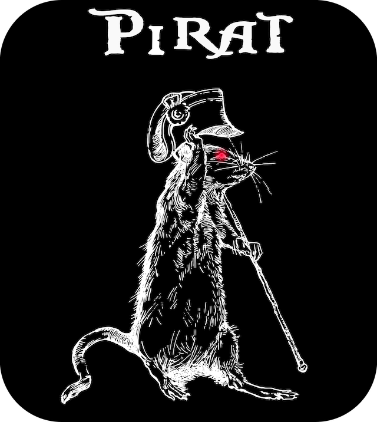
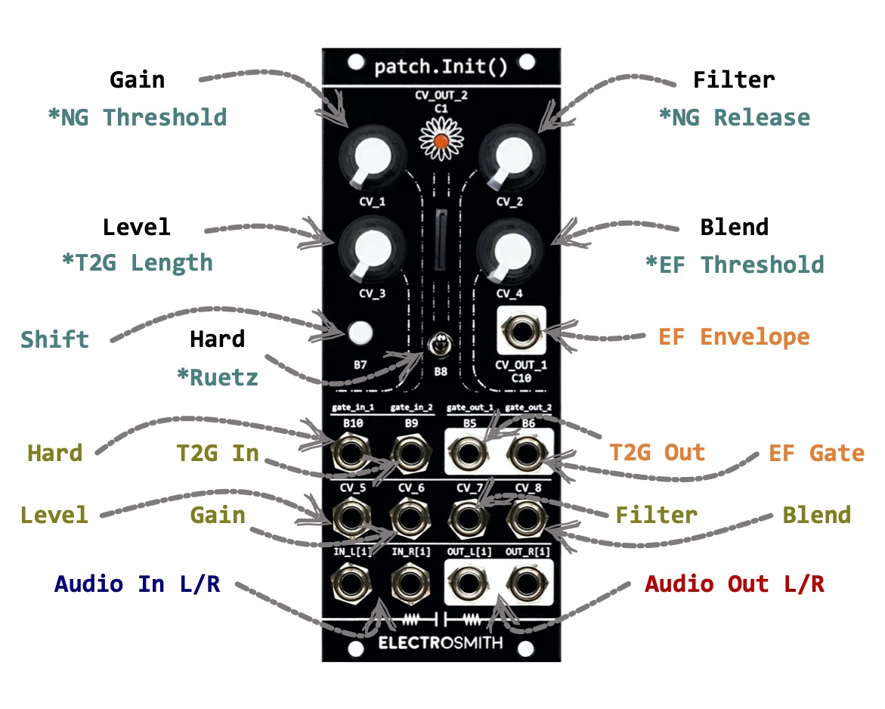
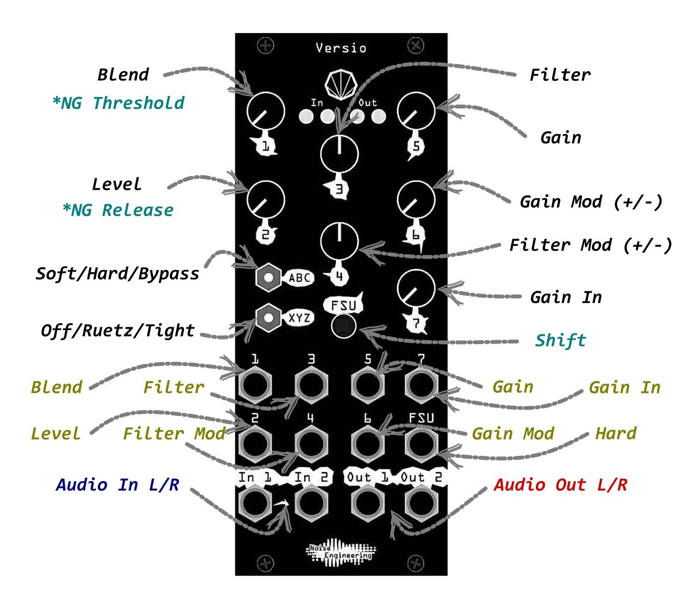
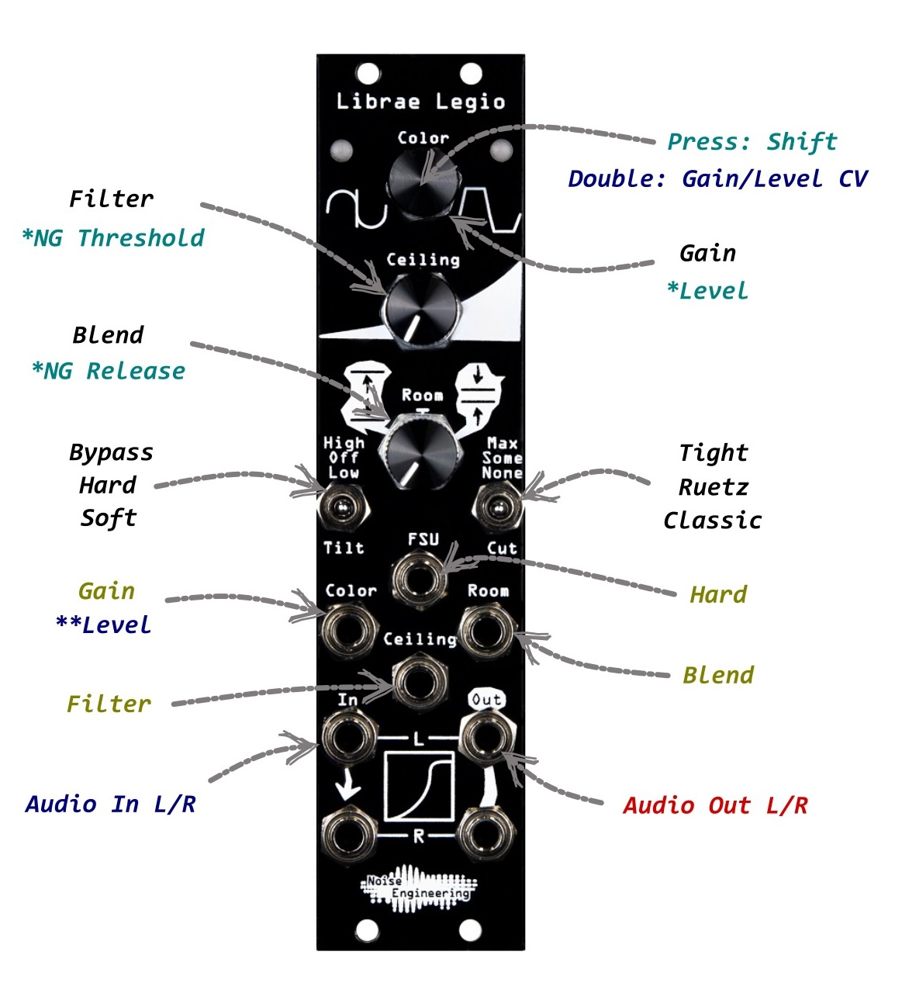

PiRAT Distortion
================

[](https://opensource.org/licenses/BSD-2-Clause) [](https://github.com/nezetic/pirat/actions/workflows/build.yml)

PiRAT is a **ProCo Rat** stomp box emulation, redesigned for Eurorack,
based on the amazing [Rodent VST](https://github.com/ValdemarOrn/SharpSoundPlugins) from Valdemar Erlingsson.


The original VST includes:

- a very nice sounding emulation (based on in-depth ProCo Rat circuit analysis);
- 3 classic parameters (Gain / Tone and Level);
- various mods inspired from the hardware (turbo, ruetz, ...).


PiRAT inherits the circuit emulation from Rodent and adds its own flavor to it:

- stereo signal path;
- dry / wet mixer to cross-fade between clean / overdrive / distortion;
- mixer to blend between silicon and diode clipping in hard clipping (turbo) mode;
- optional noise gate (based on the wonderful [NoiseInvader](https://github.com/ValdemarOrn/NoiseInvaderVST) VST).


PiRAT is written using [DaisySP](https://github.com/electro-smith/DaisySP), and can run on:

- VCV Rack 2;
- Daisy Patch SM ([patch.init](https://www.electro-smith.com/daisy/patchinit) Eurorack module);
- Versio ([World of Versio](https://noiseengineering.us/pages/world-of-versio));
- Legio ([World of Legio](https://noiseengineering.us/pages/world-of-legio)).


The **Daisy Patch SM** firmware adds:

- customizable threshold / release for the noise gate;
- envelope follower (both raw signal and a gate with adjustable threshold);
- trigger to gate (with variable length).



The **Versio** firmware adds:

- customizable threshold / release for the noise gate;
- envelope modulation of gain / filter (with attenuverters).



The **Legio** firmware adds:

- customizable threshold / release for the noise gate.



---

Installation
------------

PiRAT firmware can be directly downloaded on [GitHub](https://github.com/nezetic/pirat/releases) (or compiled from sources).

It can be flashed using Electro-smith [Daisy web programmer](https://electro-smith.github.io/Programmer/) or Noise Engineering [portal](https://portal.noiseengineering.us).

**Warning**: flashing your module with PiRAT will be done at your own risk!
That said, Daisy based modules are able to recover if anything goes wrong during the flash procedure.
So it should always be possible to restart it and/or flash an official firmware back.

---

Compilation
-----------

### Dependencies

#### linux (ubuntu)

```
$ sudo apt-get install build-essential git cmake gcc-arm-none-eabi binutils-arm-none-eabi dfu-util jq zstd libgl-dev
```

#### macOS

Require Xcode and MacPorts (or any alternative).

```
$ sudo port install cmake dfu-util jq zstd
```

The `arm-none-eabi` compilation tools are currently broken on MacPorts.

Official [ARM packages](https://developer.arm.com/downloads/-/arm-gnu-toolchain-downloads) can be used instead (`arm-gnu-toolchain-12.3.rel1-darwin-arm64-arm-none-eabi.pkg` has been successfully tested).
Tools are installed in a non-standard directory (ex: `/Applications/ArmGNUToolchain/12.3.rel1/arm-none-eabi/bin`) that need to be exported in the PATH environment variable.

### Configure

From the root directory:

```
$ mkdir build
$ cd build
$ cmake ..
```

### Build

From the *build* directory created above:

#### VCV Rack

```
$ make
$ make install
```

#### Daisy Patch SM

```
$ make firmware
$ make flash
```

#### Versio

```
$ make firmware_versio
$ make flash_versio
```

#### Legio

```
$ make firmware_legio
$ make flash_legio
```

---

License
-------

PiRAT is licensed under **2-Clause BSD**, a free and open-source license. For more information, please see
[BSD-2-Clause](https://opensource.org/licenses/BSD-2-Clause).
