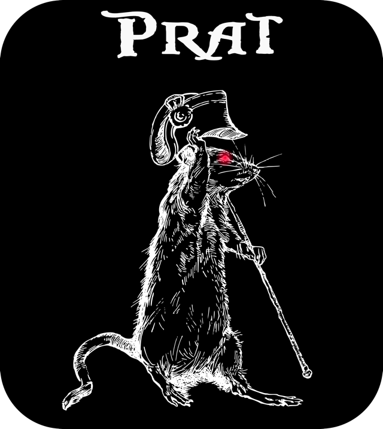
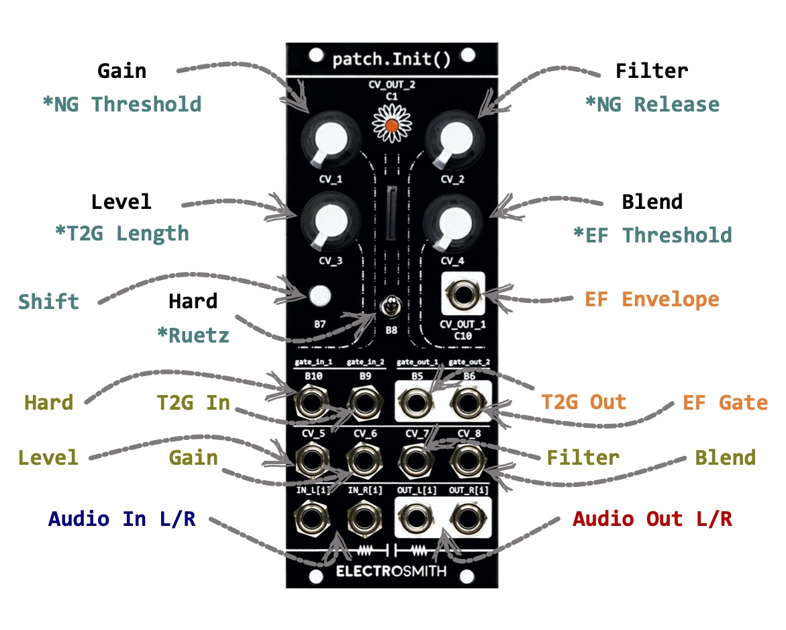

PRat Distortion
===============

[](https://opensource.org/licenses/BSD-2-Clause)

PRat is a **ProCo Rat** stomp box emulation, redesigned for Eurorack,
based on the amazing [Rodent VST](https://github.com/ValdemarOrn/SharpSoundPlugins) from Valdemar Erlingsson.


The original VST includes:

- a very nice sounding emulation (based on in-depth ProCo Rat circuit analysis);
- 3 classic parameters (Gain / Tone and Volume);
- various mods inspired from the hardware (turbo, ruetz, ...).


PRat inherits the circuit emulation from Rodent and adds its own flavor to it:

- stereo signal path;
- level parameter to attenuate the signal before the gain stage;
- dry / wet mixer to cross-fade between clean / overdrive / distortion;
- mixer to blend between silicon and diode clipping in hard clipping (turbo) mode;
- optional noise gate (based on the wonderful [NoiseInvader](https://github.com/ValdemarOrn/NoiseInvaderVST) VST).


PRat is written using [DaisySP](https://github.com/electro-smith/DaisySP), and can run on:

- VCV Rack 2;
- Daisy Patch SM ([patch.init](https://www.electro-smith.com/daisy/patchinit) Eurorack module);
- Versio ([World of Versio](https://noiseengineering.us/pages/world-of-versio));
- Legio ([World of Legio](https://noiseengineering.us/pages/world-of-legio)).


The **Daisy Patch SM** firmware adds:

- customizable threshold / release for the noise gate;
- envelope follower (both raw signal and a gate with adjustable threshold);
- trigger to gate (with variable length).



The **Versio** firmware adds:

- customizable threshold / release for the noise gate;
- envelope modulation of gain / filter (with attenuverters).


The **Legio** firmware adds:

- customizable threshold / release for the noise gate.

---

Compilation
-----------

### Dependencies

#### linux (ubuntu)

```
$ sudo apt-get install build-essential git cmake gcc-arm-none-eabi binutils-arm-none-eabi jq zstd libgl-dev
```

#### macOS

Require Xcode and MacPorts (or any alternative).

```
$ sudo port install cmake arm-none-eabi-gcc arm-none-eabi-binutils jq zstd
```

### Configure

From the root directory:

```
$ mkdir build
$ cd build
$ cmake ..
```

### Build

From the *build* directory created above:

#### VCV Rack

```
$ make
$ make install
```

#### Daisy Patch SM

```
$ make firmware
$ make flash
```

#### Versio

```
$ make firmware_versio
$ make flash_versio
```

#### Legio

**Warning**: not (yet!) owning any of the Legio modules, the firmware is totally **untested** and might be **unusable**!

```
$ make firmware_legio
$ make flash_legio
```

---

License
-------

PRat is licensed under **2-Clause BSD**, a free and open-source license. For more information, please see
[BSD-2-Clause](https://opensource.org/licenses/BSD-2-Clause).
